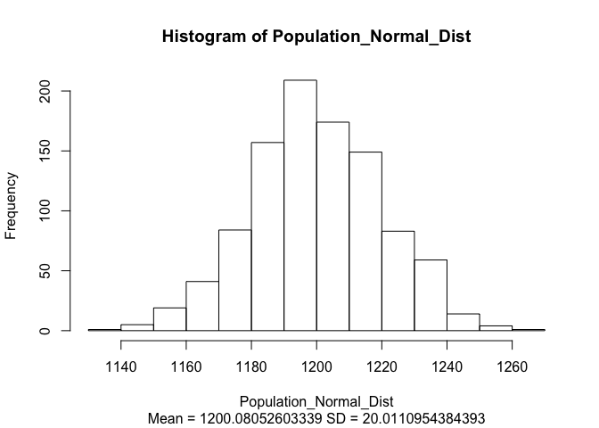
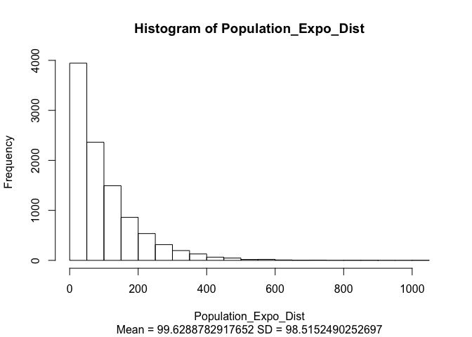
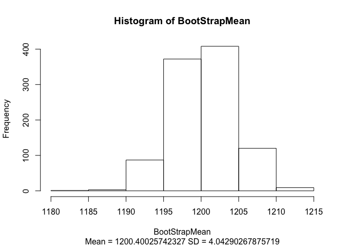
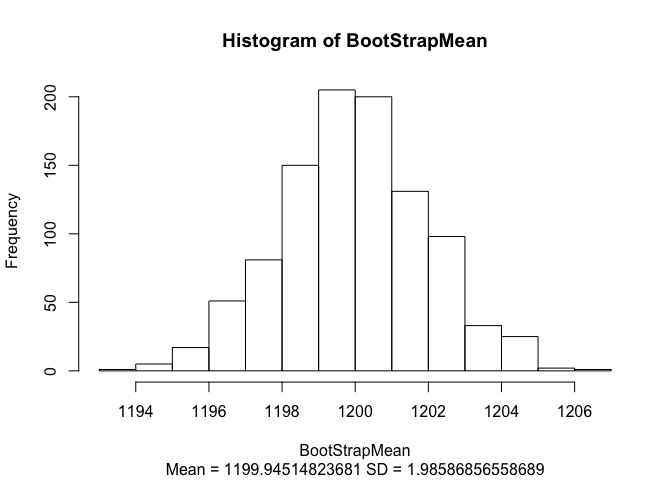
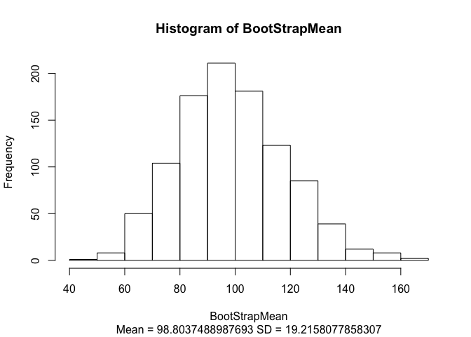
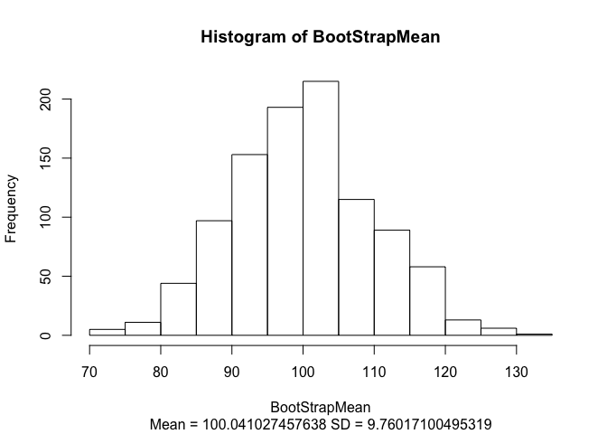

# HW4_CLT
Oscar Padilla  
June 5, 2016  


#Week 4 Homework
##Central Limit Theorem CLT

In order to illustrate the CLT in R, I wrote the following function, *BootStrapFunction* which takes a *NumberofSamples* of *SampleSize* from a given *distribution* and calculates its mean for each iteration and generates an histogram as an output


```r
BootStrapFunction <- function(distribution, SampleSize, NumberofSamples){
BootStrapMean <- numeric(NumberofSamples)
for(i in 1:NumberofSamples){
bootstrapsample <- sample(distribution, size = SampleSize, replace = TRUE)
BootStrapMean[i] <- mean(bootstrapsample)
}
hist(BootStrapMean, sub=paste("Mean =",mean(BootStrapMean),"SD =",sd(BootStrapMean)))
}
```

Now, let's generate 2 different distributions, the first is normal ($\mu$ = 1200, $\sigma$ =20), the second is exponential (rate = 0.01)


```r
Population_Normal_Dist <- rnorm (1000, 1200, 20) #My first population is normally distributed with a mean of 1200 and a sd of 20
hist(Population_Normal_Dist, sub=paste("Mean =",mean(Population_Normal_Dist),"SD =",sd(Population_Normal_Dist)))
```

<!-- -->

```r
Population_Expo_Dist <- rexp(10000, 0.01) #My second population is exponentially distributed with a rate of 0.01
hist(Population_Expo_Dist, sub=paste("Mean =",mean(Population_Expo_Dist),"SD =",sd(Population_Expo_Dist)))
```

<!-- -->

## CLT ON NORMAL DISTRIBUTION

Now let's try the *BootStrapFunction* against the normal distribution, with a sample size of 25


```r
BootStrapFunction(Population_Normal_Dist, 25, 1000)
```

<!-- -->

If we increase the sample size to 100


```r
BootStrapFunction(Population_Normal_Dist, 100, 1000)
```

<!-- -->

The standard deviation of the population 20.0110954 divided by the square root of the *SampleSize* approximates to 2.0011095

## CLT ON EXPONENTIAL DISTRIBUTION

Now let's try the *BootStrapFunction* against the Exponential distribution, with a sample size of 25


```r
BootStrapFunction(Population_Expo_Dist, 25, 1000)
```

<!-- -->

If we increase the sample size to 100


```r
BootStrapFunction(Population_Expo_Dist, 100, 1000)
```

<!-- -->

The standard deviation of the population 98.515249 divided by the square root of the sample size approximates to 9.8515249
